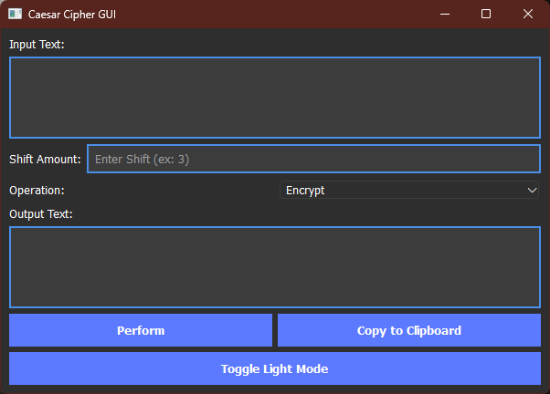

# Caesar Cipher Tool GUI

A GUI-based Caesar Cipher encryption and decryption tool built with PyQt6.

## Features
- Encrypt or decrypt text using Caesar cipher.
- Toggle between light and dark themes.
- Copy the output to the clipboard.

## Installation
1. Ensure Python 3.9+ is installed.
2. Install required dependencies: pip install PyQt6
3. Run the app: python caesar_cipher_gui.py

## Screenshot

Below is a screenshot of the Caesar Cipher Tool GUI:

## License
This project is licensed under the MIT License. See [LICENSE](LICENSE) for details.